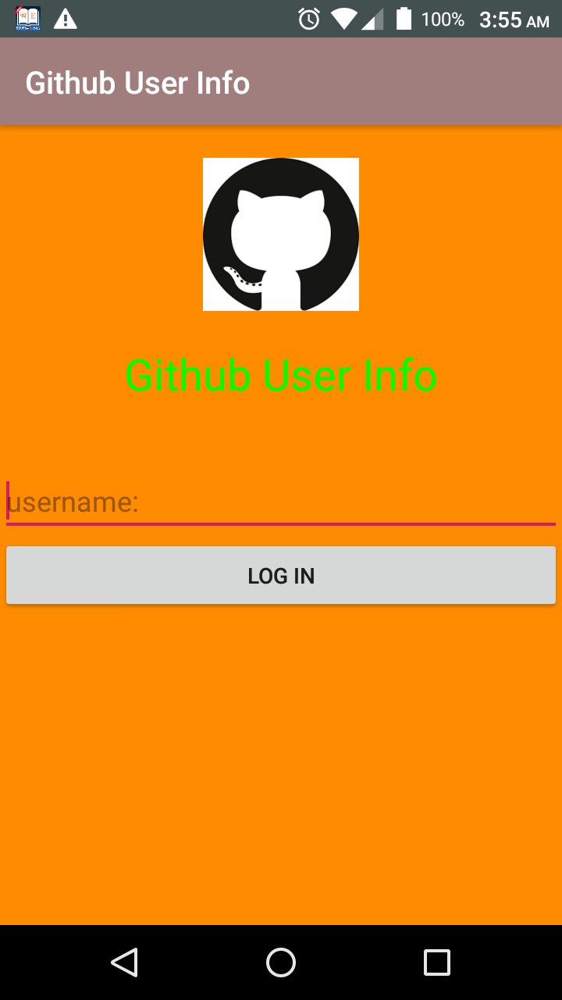
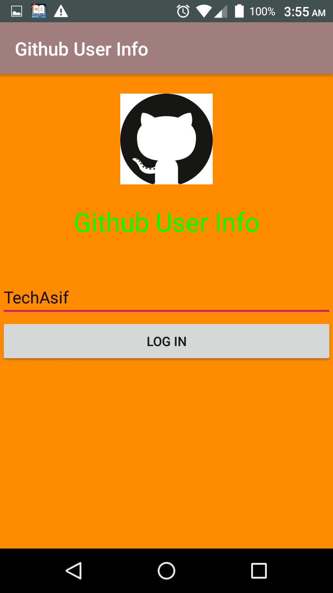
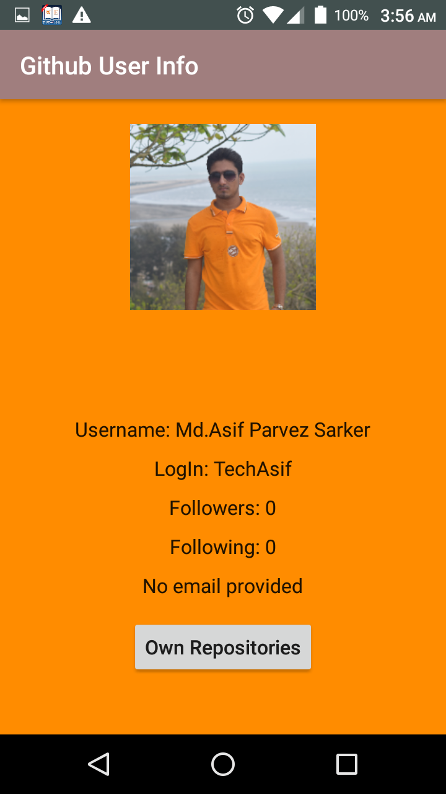

# Github-User-Info

In this project we use retrofit for get data from github api and also use glide for image load and Recycler view for view recycling 
.In this app we give a user name as input and get data from github api and display user data into app . if you want to clone this repository then you need below dependency
 
 //for retrofit
    implementation 'com.squareup.retrofit2:converter-gson:2.4.0'
    implementation 'com.squareup.retrofit2:retrofit:2.4.0'

    //for recyler view
    implementation 'androidx.recyclerview:recyclerview:1.0.0'

    //for Glide image library
    implementation 'com.github.bumptech.glide:glide:4.11.0'
    annotationProcessor 'com.github.bumptech.glide:compiler:4.11.0'
    
   #Output Image of Github User Info
   
   simple screen 1

   
   
   simple screen 2

   
   
   simple screen 3

   
   
   simple screen 4

   
   
   simple screen 5

   
   
   #Which I flow for creating this project
   
   https://www.udemy.com/course/retrofit-and-android-how-to-get-the-content-of-an-api/
   
   
   
   
